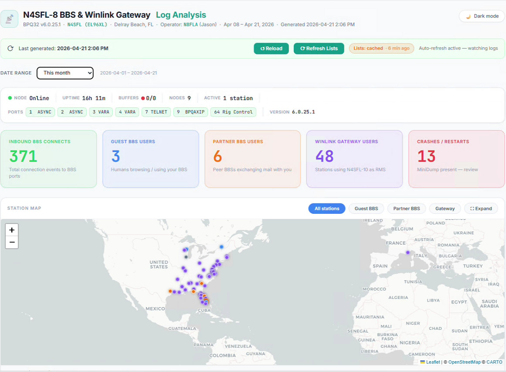

# BPQ-Dashboard

Analytics dashboard for BPQ32 packet radio BBS and Winlink gateway nodes.

Parses BPQ32 log files, fetches live data from the BPQ32 web interface, and generates a standalone HTML dashboard with an interactive map, KPI cards, date filtering, and sortable detail tables.



## Features

- **Station map** — Leaflet map with markers for Guest BBS users, Partner BBS users, and Winlink Gateway users. Locations resolved via QRZ XML API with Maidenhead grid fallback.
- **KPI cards** — Inbound connects, Guest BBS users, Partner BBS users, Winlink Gateway users, Crashes
- **BBS User Detail** — sortable table with role (Guest/Partner), location, distance, mode, last active, connects, messages, email
- **Winlink User Detail** — sortable table with location, distance, mode, client, sessions, messages, data, email
- **Activity by day** — sortable daily table with CMS polls, inbound connects, messages, unique stations
- **Forwarding partner health** — per-peer outbound forwarding bars with mode tags, filterable by date
- **Notable events** — crash/restart alerts with timestamp, new guest user notifications, forwarding failures
- **Date range filter** — Today / Yesterday / Last 7 days / This month / This year / Custom
- **Persistent history** — SQLite database accumulates parsed data across runs so no history is lost when BPQ32 rotates log files
- **Email integration** — QRZ email lookup with in-dashboard override editor; opens Outlook web compose
- **Light + dark mode** — toggle in the header

## Requirements

- BPQ32 (Windows) or LinBPQ (Linux/Raspberry Pi) with `HTTPPORT=8010`
- Python 3.9+
- No external Python packages — standard library only

## Quick start

1. Copy `bpq_dashboard.cfg.example` to `bpq_dashboard.cfg` and fill in your values.

**First run** (saves QRZ credentials):
```
cd Dashboard
python bpq_dashboard.py --qrz-user N8FLA --qrz-pass YOURPASSWORD
```

**Subsequent runs** — double-click `refresh.bat`

The dashboard opens automatically in your browser at `http://127.0.0.1:5999`.

## Files

| File | Purpose |
|---|---|
| `bpq_dashboard.py` | Main script — parses logs, resolves locations, generates HTML |
| `dashboard_server.py` | Local HTTP server — serves the dashboard and saves email edits to the DB |
| `refresh.bat` | Windows one-click refresh — runs the script and opens the browser |
| `bpq_dashboard.cfg` | Saved credentials (QRZ, BPQ32 token) — created on first run |
| `bpq_history.db` | SQLite history database — created on first run |
| `bbs_users.txt` | Optional manual BBS user list with last-connect dates |

## Configuration

`bpq_dashboard.py` top-of-file constants:

```python
LOG_DIR   = r"C:\Users\...\BPQ32\Logs"   # path to your BPQ32 log directory
HOME_CALL = "N4SFL"                        # your node callsign
HOME_GRID = "EL96XL"                       # your Maidenhead grid
HOME_LAT  = 26.46                          # your latitude
HOME_LNG  = -80.10                         # your longitude
OP_CALL   = "N8FLA"                        # your operator callsign
LOCATION  = "Delray Beach, FL"
```

## bbs_users.txt format

One callsign per line, optional last-connect date:
```
# Manual BBS user list
KB9PVH  02-Dec 06:11Z
KO4TZK  31-Dec 05:47Z
KR4HNY  09-Feb 21:01Z
K1AJD
```

## How it works

1. Parses `log_*_BBS.txt`, `CMSAccess_*.log`, `ConnectLog_*.log`, `log_*_DEBUG.txt`
2. Fetches the BPQ32 registered user list from `http://127.0.0.1:8010/Mail/Users`
3. Looks up callsign locations via QRZ XML API (cached in `qrz_cache.json`)
4. Merges all data with the SQLite history database
5. Generates `N4SFL_Dashboard.html`
6. `dashboard_server.py` serves it at `http://127.0.0.1:5999` and provides a `/api/email` endpoint for in-dashboard email editing

## Credits

Developed by N8FLA (Jason) — Delray Beach, FL  
Node: N4SFL.#SFL.FL.USA.NOAM  
GitHub: jayflanzbaum-svg

BPQ32 by John Wiseman G8BPQ — cantab.net/users/john.wiseman

## License

MIT — free to use, modify, and distribute. Credit appreciated but not required.

73 de N8FLA
